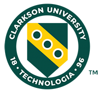

{: .float-right}

# **EE368 Software Engineering**

{: .d-block}

**_(Spring 2021 (10:20AM – 11:10AM Jan. 13, 2021 – Apr. 30, 2021))
(3) Credit Hours_**

---

## **Instructor Contact Information**

Name: `Yu Liu`  
Office Address: `CAMP 166`  
Phone Number: `(315)268-6510`  
Email Address: `yuliu@clarkson.edu`  
Student Hours: `Appointment by Email at anytime`

- Will be virtually via Zoom in Spring 2021.

## **Instructor Participation**

During this course, as your instructor, you can expect me to

> - Respond to emails and voicemails within 12 hours
> - Grade activities and assessments within 7 days
> - Be an active participant on the discussion board

### **Delivery Method**

> ### **Online: Synchronous Online by Zoom (<https://clarkson.zoom.us/j/8464946103>) (Note: few students have schedule conflicting with other courses due to the COVID-19 measures in campus and they have the permission to attend this course in async mode. Their presentation can be recorded and played by the team leader.)**

## **Course Description**

Students will participate in managing and executing the process of carrying a significant software development effort from a conceptual idea of new features through integration and testing of the entire feature working on an existed product. This will require them to independently: (a). investigate appropriate technologies, (b). identify relevant risk factors, (c). address issues associated with software quality assurance; Students will produce appropriate documentation of system requirements and design, testing efforts and user interfaces; Students will demonstrate an ability to evaluate the suitability of available technology for use in development of the product; Students will gain experience with issues encountered in maintenance of software systems; Students will be aware of the social and ethical issues of concern to software engineers and the impact of software engineering solutions on modern society; Students will be able to function as an effective member of a team of professionals; Students will gain experience independently learning new technology.

## **Instructional Materials**

> ### **Textbook(s)**
>
> - Software Engineering: The Current Practice, Vaclav Rajlich, CRC Press

## **Technology**

> - ## [Computer System & Software Requirements](https://confluence.clarkson.edu/display/OITKB/Technology+recommendations+for+Distance+and+Online+Learning)
> - ## [Software Accessibility Policies](https://confluence.clarkson.edu/display/OITKB/Accessibility+Statements) in General
> - ## [Software Privacy Policies](https://confluence.clarkson.edu/display/OITKB/Privacy+Policies) in General
> - ## Specific Course Software Policies

> ### **Minimum Technology Skills**
>
> - Use a learning management system
> - Program in the C language
> - Use the Linux Operation System

## **Course Outcomes (CO)**

CO1: Explain the concepts of the software maintenance process and techniques.

CO2: Be familiar with the software maintenance process through the practice in the course project.

CO3: Improve the capability of teamwork, problem solving, risk analysis, etc.
